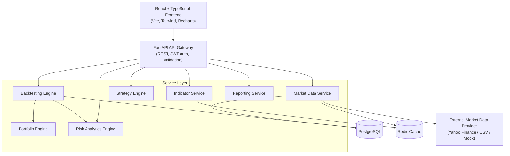
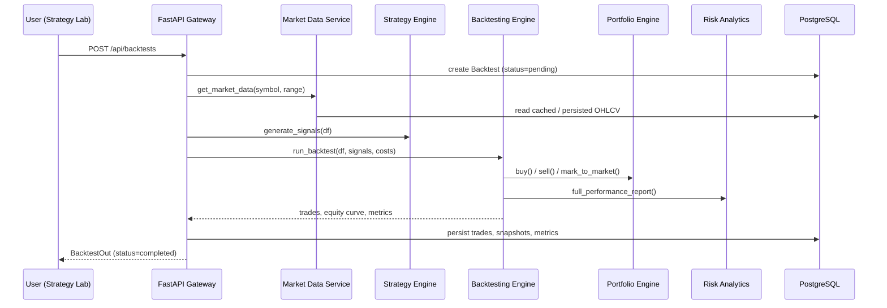

# QuantX — Algorithmic Trading & Backtesting Platform

QuantX is a full-stack research and simulation platform for designing, testing, and
analyzing systematic trading strategies against historical market data.

> **QuantX does not execute real trades and does not provide personalized investment
> advice.** Every result in this platform is a historical simulation. Past performance
> does not guarantee future results.

---

## 1. Project Overview

QuantX lets a user select an instrument, pull historical OHLCV data, compute technical
indicators, configure a trading strategy, and run a realistic historical backtest that
accounts for transaction costs and slippage. Results are presented through equity
curves, drawdown charts, trade-by-trade breakdowns, and a full suite of risk-adjusted
performance metrics (Sharpe, Sortino, Calmar, max drawdown, etc.). Strategies can be
compared side by side, tuned via parameter optimization with an out-of-sample holdout,
and stress-tested with walk-forward analysis.

## 2. Architecture



### Request flow for a backtest



## 3. Features

- Provider-agnostic market data ingestion (Yahoo Finance, CSV upload, or a deterministic
  synthetic "mock" provider for offline development and CI)
- Data quality safeguards: duplicate detection, invalid-record rejection, chronological
  sorting, forward-fill of missing values
- 11 technical indicators across trend, momentum, volatility, and volume categories
- 4 pluggable strategies (Moving Average Crossover, RSI Reversal, Bollinger Mean
  Reversion, MACD) behind a common `Strategy` interface, fully parameterized
- A bar-by-bar backtesting engine that fills orders at the *next* bar's open relative to
  the signal bar's close, explicitly preventing look-ahead bias
- Transaction costs and slippage modeled per trade
- Full risk & performance analytics: Total Return, CAGR, Annualized Volatility, Sharpe,
  Sortino, Max Drawdown, Calmar Ratio, Win Rate, Profit Factor, Avg Win/Loss, Avg Holding
  Period
- Parameter grid-search optimization with an explicit out-of-sample holdout
- Walk-forward analysis with rolling train/test windows
- Strategy comparison (metrics shown neutrally — no strategy is labeled "best")
- JWT-based auth; each user only sees their own backtests
- Professional dark-mode "financial terminal" UI
- Dockerized, with CI running backend + frontend tests, linting, and Docker builds

## 4. Tech Stack

| Layer      | Technology                                                             |
|------------|-------------------------------------------------------------------------|
| Frontend   | React 18, TypeScript, Vite, Tailwind CSS, Recharts, Axios, React Router, Zustand |
| Backend    | Python 3.11, FastAPI, Pydantic v2, Pandas, NumPy, SciPy, scikit-learn   |
| Database   | PostgreSQL 16 (SQLAlchemy ORM + Alembic migrations)                    |
| Caching    | Redis 7                                                                 |
| Infra      | Docker, Docker Compose, GitHub Actions                                 |

## 5. Installation

```bash
git clone <this-repo>
cd quantx
```

### Environment variables

Copy the example env file and adjust as needed:

```bash
cp backend/.env.example backend/.env
```

| Variable                       | Purpose                                             | Default (dev)     |
|--------------------------------|------------------------------------------------------|--------------------|
| `DATABASE_URL`                 | SQLAlchemy connection string                         | local Postgres     |
| `REDIS_URL`                    | Redis connection string                              | local Redis        |
| `SECRET_KEY`                   | JWT signing secret — **change in production**        | placeholder        |
| `ACCESS_TOKEN_EXPIRE_MINUTES`  | JWT expiry                                            | 1440 (24h)         |
| `MARKET_DATA_PROVIDER`         | `yahoo` \| `csv` \| `mock`                            | `mock`             |
| `RISK_FREE_RATE_ANNUAL`        | Used in Sharpe/Sortino                                | `0.02`             |

The `mock` provider generates deterministic, seeded synthetic OHLCV data so the whole
platform runs end-to-end with **no external network access or API keys** — useful for
local development, demos, and CI. Switch `MARKET_DATA_PROVIDER=yahoo` to pull real
historical data via `yfinance`.

## 6. Database Setup

Tables are created automatically on backend startup for local development. For a
production-style workflow, use Alembic migrations instead:

```bash
cd backend
alembic upgrade head
```

Schema: `users`, `instruments`, `market_data`, `strategies`, `backtests`,
`backtest_trades`, `portfolio_snapshots`, `optimization_runs`. Market data is indexed on
`(symbol, timestamp)` with a uniqueness constraint to prevent duplicate bars.

## 7. Running Locally (without Docker)

**Backend**

```bash
cd backend
python -m venv .venv && source .venv/bin/activate
pip install -r requirements.txt
uvicorn app.main:app --reload
```

**Frontend**

```bash
cd frontend
npm install
npm run dev
```

Frontend dev server runs at `http://localhost:5173` and proxies `/api` to
`http://localhost:8000`.

## 8. Docker Instructions

```bash
docker compose up --build
```

This starts `postgres`, `redis`, `backend` (port 8000), and `frontend` (port 3000).

## 9. API Documentation

FastAPI generates interactive Swagger docs automatically at:

```
http://localhost:8000/docs
```

Key endpoints:

```
POST   /api/auth/register
POST   /api/auth/login
POST   /api/market-data/import
GET    /api/market-data/{symbol}
GET    /api/indicators/{indicator}
GET    /api/strategies
POST   /api/backtests
GET    /api/backtests/{id}
GET    /api/backtests/{id}/trades
GET    /api/backtests/{id}/metrics
GET    /api/backtests/{id}/equity-curve
POST   /api/optimization
POST   /api/walk-forward
GET    /api/instruments
```

## 10. Strategy Documentation

| Key                        | Description                                                                 | Default Params                          |
|-----------------------------|-------------------------------------------------------------------------------|-------------------------------------------|
| `ma_crossover`              | BUY when short SMA crosses above long SMA; SELL on the reverse cross         | `short_window=20`, `long_window=50`      |
| `rsi_reversal`               | BUY when RSI exits oversold; SELL when it exits overbought                   | `period=14`, `oversold=30`, `overbought=70` |
| `bollinger_mean_reversion`  | BUY below the lower band; SELL above the upper band                         | `period=20`, `num_std=2.0`               |
| `macd`                       | BUY when MACD line crosses above signal line; SELL on the reverse cross      | `fast=12`, `slow=26`, `signal=9`         |

All strategies implement `Strategy.generate_signals(df) -> pd.Series[BUY/SELL/HOLD]`
using only causal (rolling/ewm) computations — no future data is ever used to form a
signal.

## 11. Backtesting Methodology

**Look-ahead bias prevention** is the central design constraint of the engine:

1. Every indicator is computed with pandas rolling/`ewm` windows, which are strictly
   causal — the value at row *i* depends only on rows `<= i`.
2. A strategy's signal at bar *i* (formed using bar *i*'s close) is **executed at bar
   `i+1`'s open**, never at bar *i*'s own close or open. This is enforced directly in
   `backtesting/engine.py`, and is covered by a dedicated regression test
   (`test_signal_executes_at_next_bar_open_not_same_bar_close`).
3. Any open position is liquidated at the final bar's close so the equity curve reflects
   fully realized performance.
4. Transaction costs and slippage are applied per trade: slippage worsens the execution
   price (higher on buys, lower on sells); transaction costs are a percentage fee on
   notional.

**Known limitations** (see §16):

- Long-only, single-symbol backtests in v1 (no shorting, no multi-asset portfolios yet)
- Survivorship bias is not modeled — the mock/demo dataset does not simulate delisted
  securities, and live-data backtests inherit whatever survivorship characteristics the
  underlying data provider has
- Corporate-action adjustments depend on the data provider (Yahoo's `Adj Close` is used
  when available; the mock provider does not simulate splits/dividends)
- Market holidays are handled implicitly by only generating/fetching business-day bars

## 12. Risk Metrics — Formulas

All ratios use a 252-trading-day annualization convention.

```
Total Return       = (V_end / V_start) - 1
CAGR               = (V_end / V_start) ^ (365.25 / days_held) - 1
Daily Return r_t    = V_t / V_(t-1) - 1
Annualized Vol      = std(r_t) * sqrt(252)
Sharpe Ratio        = (mean(r_t) * 252 - risk_free_rate) / (std(r_t) * sqrt(252))
Sortino Ratio       = (mean(r_t) * 252 - risk_free_rate) / (downside_std(r_t) * sqrt(252))
Max Drawdown        = min_t( V_t / running_max(V_0..t) - 1 )
Calmar Ratio        = CAGR / abs(Max Drawdown)
Win Rate            = (# winning trades) / (# closed trades)
Profit Factor       = sum(winning PnL) / abs(sum(losing PnL))
Avg Holding Period  = mean(exit_timestamp - entry_timestamp) across round-trip trades
```

## 13. Testing

**Backend** (pytest):

```bash
cd backend
pytest --cov=app --cov-report=term-missing
```

Covers: indicator correctness and causality (no look-ahead), strategy signal
generation, portfolio fee/slippage/P&L accounting, all risk-metric formulas, the
backtesting engine end-to-end (including a dedicated look-ahead-bias regression test),
and market-data cleaning/validation.

> Note: the indicator, risk-metric, strategy, portfolio, and engine modules were also
> smoke-tested directly against a live pandas/NumPy interpreter during development to
> confirm correctness (e.g. SMA output verified against a manual rolling mean; max
> drawdown verified against a hand-computed peak-to-trough example; a full backtest run
> verified to produce a complete, sane metrics payload).

**Frontend** (Vitest + React Testing Library):

```bash
cd frontend
npm test
```

## 14. CI/CD

`.github/workflows/ci.yml` runs on every push/PR to `main`:

1. Install backend dependencies, lint with `ruff`, run `pytest` with coverage against
   real Postgres + Redis service containers
2. Install frontend dependencies, lint, run Vitest, build the Vite bundle
3. Build both Docker images

The pipeline fails if any test or build step fails.

## 15. Limitations

- Research/education tool only — **not** a live trading system and **not** investment
  advice
- Long-only, single-symbol strategies in this version
- Historical backtests are subject to survivorship bias in the underlying data source
  and do not guarantee future performance
- Parameter optimization can overfit if the out-of-sample holdout is ignored — always
  check the out-of-sample metrics, not just the in-sample ones
- Optimization and walk-forward runs currently execute synchronously and are capped at
  200 parameter combinations per request; larger sweeps need the background-job upgrade
  described below

## 16. Future Improvements

- Background-job architecture (Celery/RQ + a task queue) for large optimization sweeps
  and walk-forward runs, per the async-processing groundwork already in the service
  layer
- Short-selling and multi-asset/portfolio-level backtests
- ML-based strategies, factor models, and portfolio optimization
- Sentiment/news-based signals; reinforcement-learning research strategies
- Options analytics
- Paper trading (still no real order execution)
- Kubernetes deployment; AWS-managed Postgres/Redis (RDS/ElastiCache)
- Distributed backtesting across a worker fleet

## 17. Engineering Metrics

The measurements below are placeholders to be filled in from your own deployment — the
codebase exposes the endpoints needed to gather them honestly rather than inventing
numbers:

| Metric                        | How to measure                                                        |
|--------------------------------|--------------------------------------------------------------------------|
| API response latency           | `GET /api/health` timing, or instrument routes with middleware          |
| Backtest execution time        | Wrap `execute_backtest()` with a timer; log to stdout/APM                |
| Dataset size                   | `SELECT count(*) FROM market_data;`                                     |
| # simulated transactions       | `SELECT count(*) FROM backtest_trades;`                                 |
| Cache hit rate                 | `GET /api/metrics/cache` (backed by Redis `INFO stats`)                  |
| Test coverage                  | `pytest --cov=app --cov-report=term-missing` output                      |
| DB query performance           | `EXPLAIN ANALYZE` on the `(symbol, timestamp)`-indexed market_data query |

---

*QuantX is a portfolio/demonstration project. It is provided for educational and
research purposes only, does not execute real trades, and does not constitute financial
or investment advice.*
